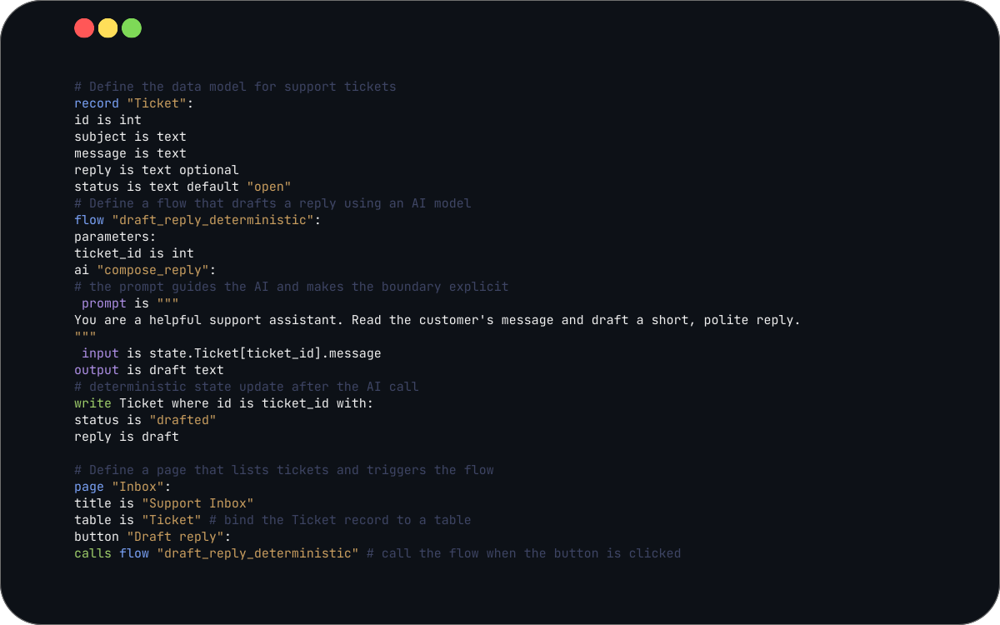

# namel3ss

namel3ss is a deterministic AI application language.
It keeps surface syntax minimal while making execution explicit, inspectable, and reproducible.

## 10-line example

```ai
spec is "1.0"

use preset "rag_chat":
  title is "Assistant"
  model is "gpt-4o-mini"
  answer_template is "summary_keypoints_recommendation_with_citations"
```

Run `n3 expand app.ai` to inspect the generated program.

## Try the RAG application

The canonical RAG example lives in [`namel3ss-apps/apps/rag-application`](https://github.com/namel3ss-Ai/namel3ss-apps/tree/main/apps/rag-application). It is an end-to-end RAG app (upload -> ingest -> ask -> citations) with deterministic flows and inspectable source previews.

From your workspace root (with `namel3ss-apps` cloned):

```bash
cd ../namel3ss-apps/apps/rag-application
n3 check app.ai
n3 run app.ai --port 7360 --no-open
```

In the UI:
1. Open `http://127.0.0.1:7360/`.
2. Upload a PDF or text document.
3. Run index/ingest actions.
4. Ask a question in chat.
5. Open citation chips/cards to inspect source evidence.

## Why this exists

- Prompt spaghetti across app code and runtime glue.
- Hidden retrieval logic that is hard to inspect.
- Hard debugging when answers are wrong.
- No deterministic replay for reliable incident analysis.
- Missing policy gating for ingestion and retrieval boundaries.

## Under the hood: expand and override

- `n3 expand app.ai` materializes the full expanded program so execution is deterministic and diffable.
- `override` lets you change targeted behavior without copying hundreds of lines from a preset.

```bash
cd ../namel3ss-apps/apps/rag-application
n3 expand app.ai > expanded.ai
```

Small expanded shape (example):

```ai
flow "rag.retrieve":
  ...
flow "rag.answer":
  ...
```

## Progressive depth

Beginner:

```ai
use preset "rag_chat":
  title is "Assistant"
```

Advanced:

```ai
override flow "rag.retrieve":
  ...
```

Advanced custom answer flow: [docs/rag/advanced_custom_answer_flow.md](docs/rag/advanced_custom_answer_flow.md)

Start simple. Expand when needed.

<p align="center">
  
</p>

<p align="center">
  <sub>
    One <code>.ai</code> file defines records, deterministic flows, explicit AI boundaries, and UI — with inspectable state changes.
  </sub>
</p>


---

## Start here

- [Quickstart](docs/quickstart.md)
- [First 5 minutes](docs/first-5-minutes.md)
- [What you can build today](docs/what-you-can-build-today.md)
- [Stability](docs/stability.md)
- [Limitations](resources/limitations.md)

Try it in 60 seconds: [docs/quickstart.md](docs/quickstart.md).

## Run modes

- `n3 run app.ai` runs in production mode and renders only user-facing UI.
- `n3 run studio app.ai` (or `n3 run --studio app.ai`) starts Studio (alias of `n3 studio app.ai`).
- `n3 studio app.ai` remains available as the dedicated Studio inspector command.
- UI blocks can be marked with `debug_only` metadata so they render only in Studio mode.
- Custom UI components are opt-in via `use plugin "name"` and require `custom_ui` in `capabilities`.

## What you can run today

- Templates: [docs/templates.md](docs/templates.md)
- Template contract: [templates/](templates/)
- Demos: [src/namel3ss/demos](src/namel3ss/demos)
- Studio (inspection UI): [docs/studio.md](docs/studio.md)

## RAG support (deterministic)

namel3ss supports production-grade retrieval-augmented generation as a first-class pattern:
- Deterministic ingestion and retrieval
- Answering with mandatory citations
- PDF page preview and exact source highlighting
- Explain mode for auditable selection
- Optional embeddings (runtime config only, no grammar changes)

See the canonical overview: [docs/rag/overview.md](docs/rag/overview.md)

## Core stable

Core stable is the graduation gate for the language surface, compiler determinism, and safety guards.
See the authoritative definition in [docs/graduation/core_stable.md](docs/graduation/core_stable.md).

## Get started

### Develop from source
Use this for development and testing.

```bash
python3 -m venv .venv && . .venv/bin/activate
python3 -m pip install --upgrade pip && python3 -m pip install -e ".[dev]"
python3 -m namel3ss --help
```

### Run with Docker (isolated runtime)
Use this for a clean, repeatable runtime.

```bash
docker build -t namel3ss:local .
docker run --rm namel3ss:local n3 --help
```

### Learn / explore (docs & templates)
Use the local Docker image to open Studio for a bundled demo.

```bash
docker run -d --name namel3ss_studio -p 7340:7340 \
  -v "$PWD:/workspace" -w /workspace \
  namel3ss:local n3 app/app.ai studio --host 0.0.0.0 --port 7340
docker logs namel3ss_studio
docker rm -f namel3ss_studio
```

See [docs/install-and-run.md](docs/install-and-run.md) for complete install and Studio instructions.

## Installation (summary)

Supported paths:
- Install from source (development)
- Docker (local) for an isolated runtime

Full guide: [docs/install-and-run.md](docs/install-and-run.md)

Docker quick check:
```bash
docker build -t namel3ss:local .
docker run --rm namel3ss:local n3 --help
```

## Install + Verify

Install (source, editable):
```bash
python3 -m pip install --upgrade pip
python3 -m pip install -e ".[dev]"
```

Verify CLI and package:
```bash
n3 --version
n3 doc
python3 tools/package_verify.py
```

Verify embedding (C example, requires C toolchain + cargo):
```bash
python3 -m pytest -q tests/embed/test_embed_c_example.py
```

## Browser Protocol

Browser Protocol is defined in [docs/runtime/browser-protocol.md](docs/runtime/browser-protocol.md).
<!-- docs\runtime\browser-protocol.md -->

## Docker & CI guarantees

- Docker builds install from local source, not PyPI.
- Docker builds are validated in CI.
- CLI smoke tests are enforced automatically.
- Wheel installs are smoke-tested in release automation.

References:
- [Dockerfile](Dockerfile)
- [CI workflow](.github/workflows/ci.yml)
- [Release workflow](.github/workflows/release.yml)
- [Docker build guard](tools/docker_build_guard.py)
- [Wheel install check](tools/wheel_install_check.py)

## Release & governance

Release invariants (enforced):
- VERSION is metadata.
- Docker builds do not depend on PyPI.
- Publish is gated by CI and guards.
- Canonical sequence: VERSION bump → tests → tag → PyPI publish → docker image → release notes.

References:
- [Release readiness](docs/release-ready.md)
- [Release workflow](.github/workflows/release.yml)

## How it works (high level)

Design guarantees:
- Deterministic execution
- Explicit AI boundary
- Inspectable state and traces
- Governed memory

Runtime guarantees:
- Stable CLI surface
- Deterministic manifests and outputs
- Read-only diagnostics and explain output
- Safe cleanup of runtime artifacts

See [docs/trust-and-governance.md](docs/trust-and-governance.md).

## UX as a Contract

UX behavior is deterministic and explainable through stable manifests and `n3 see` output.

Guarantees:
- Uploads (progress, preview metadata, async errors)
- Conditional UI (state-gated visibility)
- Reusable UI patterns (compile-time expansion)
- Accessibility by default (roles, labels, keyboard, contrast)

Detailed UX contracts: [docs/ui/overview.md](docs/ui/overview.md)

## Language Contracts

Language Contracts are defined here:
- [docs/language/application-runtime.md](docs/language/application-runtime.md)
- [docs/language/application-data-model.md](docs/language/application-data-model.md)
- [docs/language/backend-capabilities.md](docs/language/backend-capabilities.md)
- [docs/language/no-dependencies.md](docs/language/no-dependencies.md)
- [docs/language/capability-packs.md](docs/language/capability-packs.md)
<!--
docs\language\application-runtime.md
docs\language\application-data-model.md
docs\language\backend-capabilities.md
docs\language\no-dependencies.md
docs\language\capability-packs.md
-->

## Reserved identifiers

If you must use reserved identifiers, escape them with backticks and use `n3 reserved` to list them. The reserved words list is in [docs/language/reserved-words.md](docs/language/reserved-words.md).

## Documentation index

Getting started:
- [Install and run](docs/install-and-run.md)
- [Quickstart](docs/quickstart.md)

Language & grammar:
- [Grammar contract](docs/language/grammar_contract.md)
- [Application runtime](docs/language/application-runtime.md)
- [Application data model](docs/language/application-data-model.md)
- [Backend capabilities](docs/language/backend-capabilities.md)

Runtime & backend:
- [Data and migrations](docs/data.md)
- [Observability](docs/observability.md)
- [Model training](docs/training.md)
- [Streaming responses](docs/streaming.md)
- [Performance hardening](docs/performance.md)
- [Browser protocol](docs/runtime/browser-protocol.md)

UI & Studio:
- [Studio](docs/studio.md)
- [UI DSL](docs/ui-dsl.md)

Governance & releases:
- [Release readiness](docs/release-ready.md)
- [Stability](docs/stability.md)

## Discussions & Design Conversations

GitHub Discussions is the canonical place for architectural and language design conversations. Use Discussions for design questions, trade-offs, and long-form proposals; use Issues for bugs and actionable feature requests.

Reference discussion: [https://github.com/namel3ss-Ai/namel3ss/discussions/2](https://github.com/namel3ss-Ai/namel3ss/discussions/2)

## Contributing

See [CONTRIBUTING.md](CONTRIBUTING.md).

Summary:
- Clone the repo.
- Create and activate a virtual environment.
- Install editable + run tests (`python3 -m pytest -q`).

## Troubleshooting

- CLI not found: follow [docs/install-and-run.md](docs/install-and-run.md).
- Icon registry missing: use Docker or install from source per [docs/install-and-run.md](docs/install-and-run.md).
- Virtualenv confusion: recreate the venv per [docs/install-and-run.md](docs/install-and-run.md).
